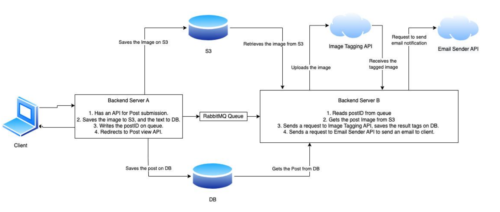

# Cloud-ad-registration-service

In this project, we created a service for registering ads using various cloud services. We utilized AWS S3 for object-based storage, MongoDB for our NoSQL database, Mailgun for sending emails, Immaga for image recognition, and FastAPI for the server-side application. The goal was to practice using these technologies in different parts of the service, such as storing data, saving files, processing images, and sending notifications.

People can post ads for their vehicles, including cars, motorcycles, and bikes. Each ad includes text and images, along with the person's email. First, our service checks the ad to make sure it's valid. Ads are then sorted into categories based on the type of vehicle shown in the images. If an ad doesn't show a vehicle, it won't be accepted.

After checking the ad, the person who posted it will get an email about the result. If the ad is approved, the email will have a link to the ad and its category. If the ad is not accepted, the email will let the person know.

## schema

